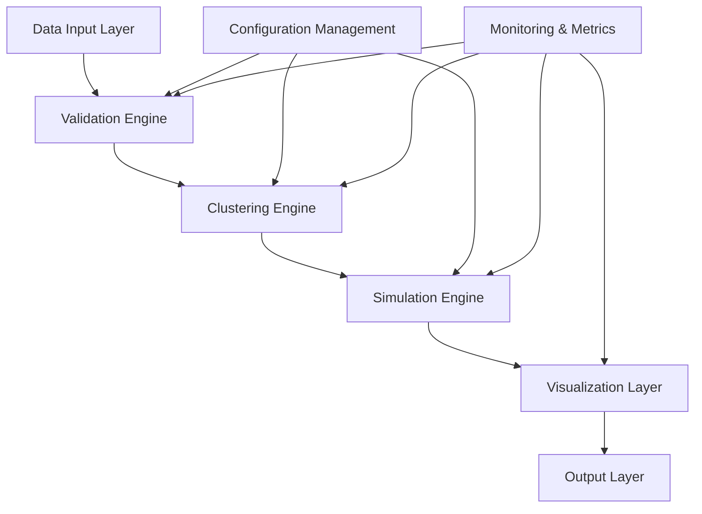

# Architecture Overview

## System Design

The observer-coordinator-insights project implements a multi-agent orchestration system for organizational analytics using a modular, event-driven architecture.

### High-Level Architecture

### Component Overview

#### Core Components

1. **Data Validation Engine** (`src/insights_clustering/validator.py`)
   - Validates Insights Discovery CSV data format
   - Ensures data quality and completeness
   - Handles anonymization and privacy controls

2. **Clustering Engine** (`src/insights_clustering/clustering.py`)
   - Implements K-means clustering algorithm
   - Optimizes cluster count using elbow method
   - Generates cluster visualizations

3. **Team Simulation Engine** (`src/team_simulator/simulator.py`)
   - Simulates team dynamics based on cluster composition
   - Evaluates team performance metrics
   - Generates composition recommendations

4. **Orchestration Layer** (`autonomous_orchestrator.py`)
   - Coordinates multi-agent workflows
   - Manages execution pipelines
   - Handles error recovery and retry logic

#### Supporting Infrastructure

1. **Configuration Management** (`backlog.yml`)
   - Centralized configuration for all components
   - Environment-specific settings
   - Feature flags and tuning parameters

2. **Metrics & Monitoring** (`metrics_reporter.py`)
   - Performance tracking
   - Usage analytics
   - Health monitoring

3. **Execution Engine** (`execution_engine.py`)
   - Task scheduling and execution
   - Resource management
   - Dependency resolution

### Data Flow

1. **Input Phase**
   - CSV data ingestion from Insights Discovery tools
   - Data validation and sanitization
   - Privacy compliance checks

2. **Processing Phase**
   - Clustering analysis with K-means algorithm
   - Team composition simulation
   - Performance metric calculation

3. **Output Phase**
   - Visualization generation (cluster wheels)
   - Report generation
   - Recommendation export

### Security Considerations

- All data encrypted at rest and in transit
- No PII logging or persistence
- GDPR-compliant data retention (180 days)
- Input validation against injection attacks
- Secure configuration management

### Performance Requirements

- Support for datasets up to 10,000 employees
- Sub-second response time for clustering analysis
- Concurrent processing of multiple simulations
- Memory-efficient data processing

### Scalability Design

- Stateless component design for horizontal scaling
- Configurable resource limits
- Async processing for I/O-bound operations
- Modular architecture for independent scaling

## Technology Stack

- **Runtime**: Python 3.9+
- **ML/Analytics**: scikit-learn, pandas, numpy
- **Visualization**: matplotlib, seaborn
- **Testing**: pytest, pytest-cov
- **Code Quality**: ruff, mypy
- **Orchestration**: Custom multi-agent framework

## Deployment Architecture

The system is designed for containerized deployment with the following patterns:

- **Development**: Local development with hot reload
- **Testing**: Isolated test environments with test data
- **Staging**: Production-like environment for validation
- **Production**: High-availability deployment with monitoring